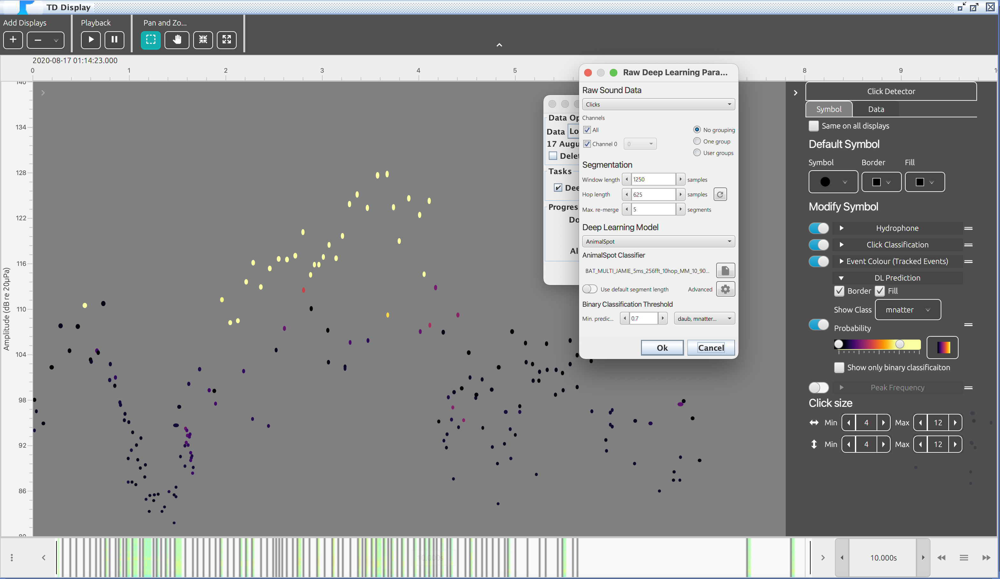
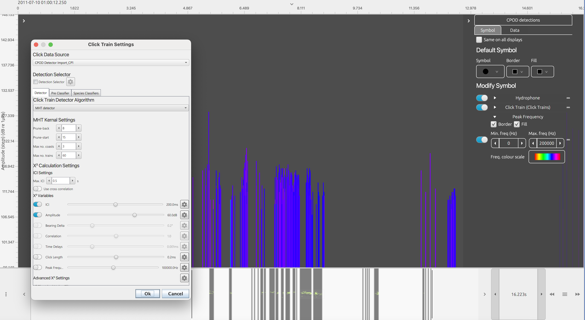

# PAMGuard_resources
A set of open sources tutorials for PAMGuard, including test data and settings files. 

## Current Tutorials
### Deep Learning
The deep learning tutorial demonstrates the use PAMGuard's [deep learning module](https://github.com/macster110/PAMGuard_DeepLearningSegmenter). The tutorial brings users through two examples, detecting right whales and classifying Danish bat species, demonstrating both PAMGuard real time and post processing capabilities along with the various display options for exploring results. The deep learning models are provided.

  

_Clicks plotted against Amplitude (dB) and coloured by the probability that a detection is a call from a Daubenton's bat (daub). The deep learning module was used to assign species probability to each detected bat call._

### Click train detection (Coming soon)
Echolocation clicks can be difficult to accurately classify, especially if they are broadband transients typically produced by most delphinid species. The click train detector module in PAMGuard tracks sequences of clicks which exhibit slowly varying properties, e.g, inter click interval, amplitude, correlation etc, and can be used with both multi and single channel data. The click train tutorial demonstrates three use cases, towed hydrophone arrays, SoundTraps and an alternative open source click train detection algorithm for CPODs.  

  

_CPOD CP1 detections imported into PAMGuard and plotted against amplitude (dB). PAMGuard's clcik train detector can be used as an alternative for the analysis of CPOD data (info on CPODs and FPODs can be found [here](https://www.chelonia.co.uk/))_
